# Excel批次插入圖片


## **環境設定**

1. 下載Release.zip並解壓縮
2. 設定 ExcelAddImage\Config.ini

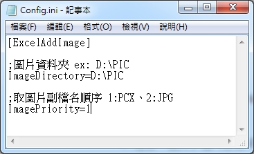

## **使用GUI**

1. 開啟Excel

   - 使用Open dialog

      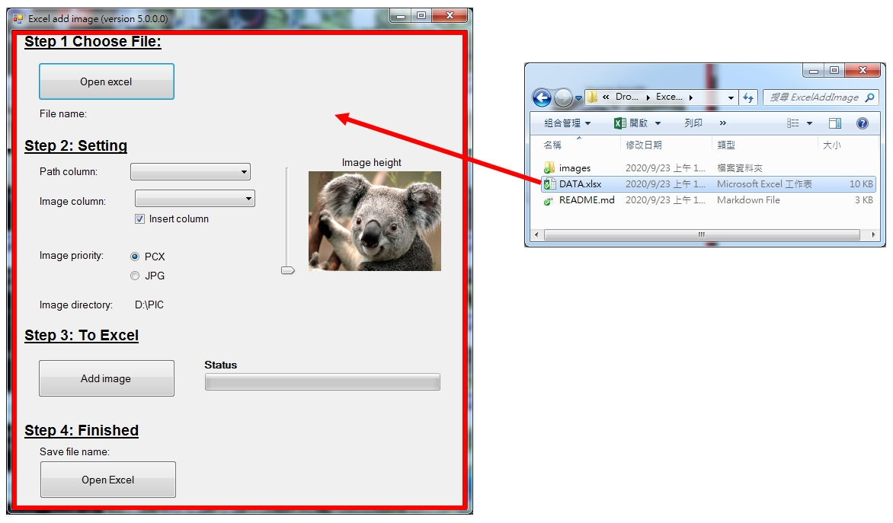

   - 使用拖曳檔案

      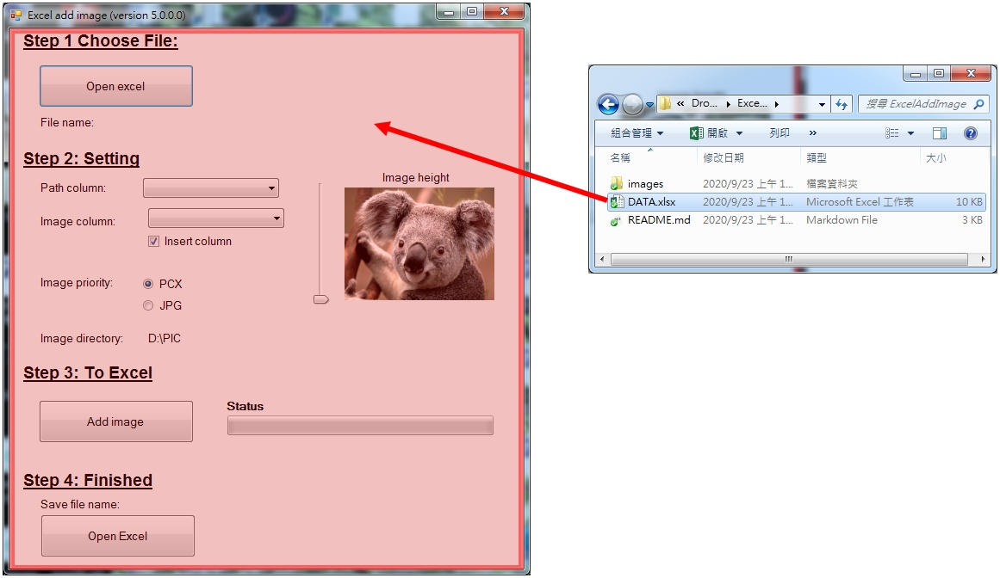

   

2. 設定說明

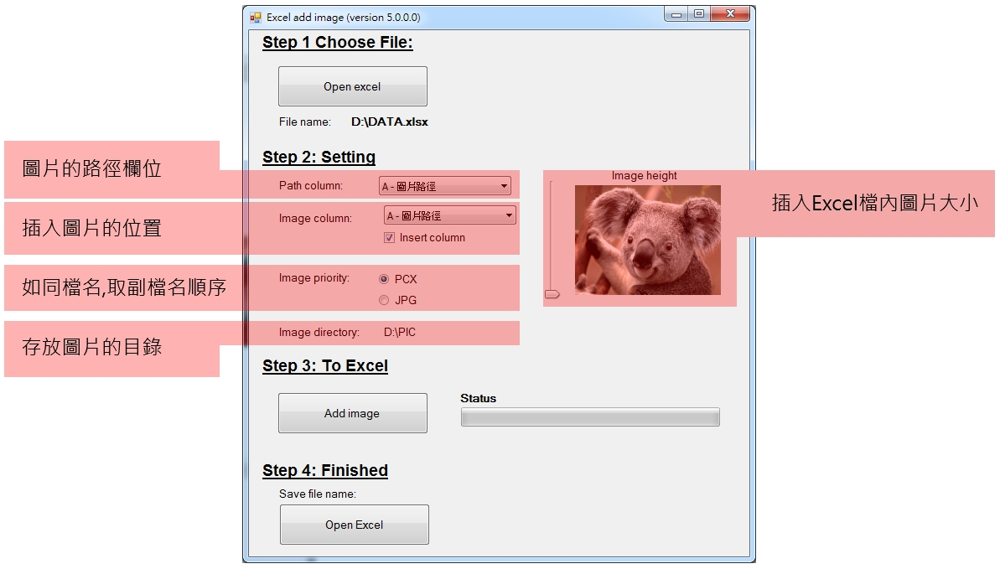


3. 圖片路徑欄位可以為下圖A欄任何格式

   
   
4. 插入圖片

   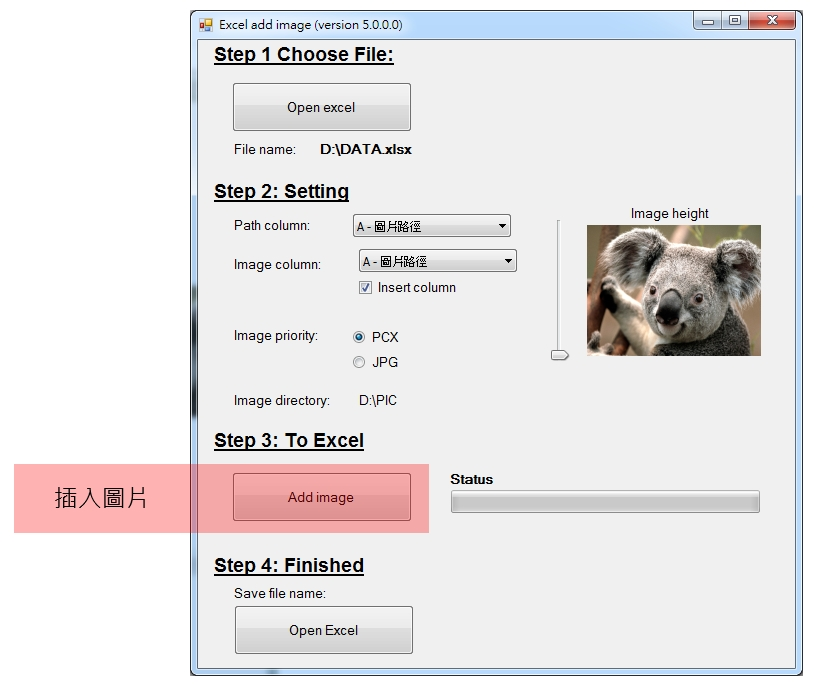

5. 插入完成檔案另存新檔

   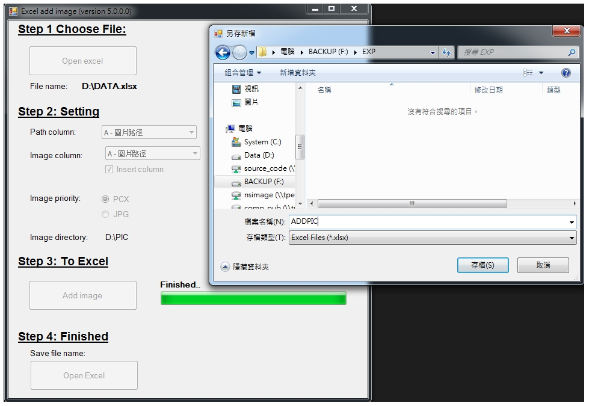

   6. 開啟Excel

      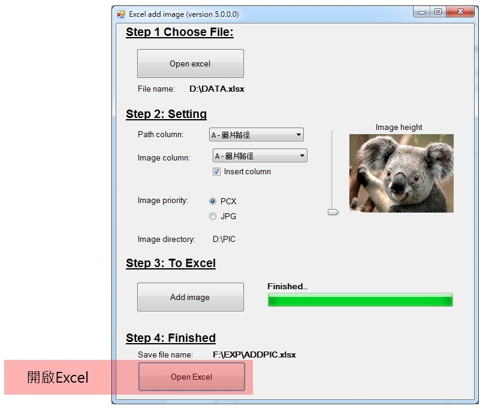

   7. 產生結果

      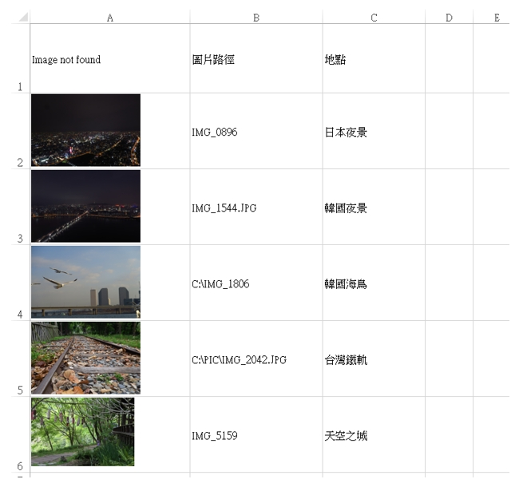


## **使用COMMAND LINE**

 1. 參數說明

    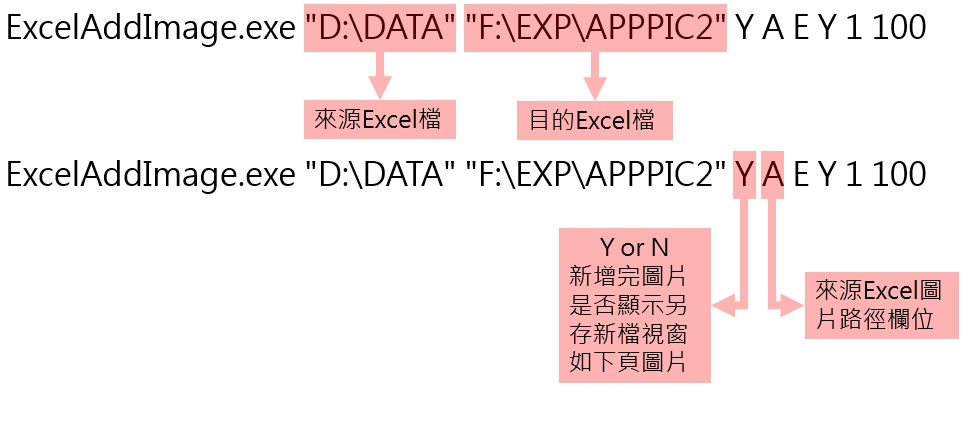

    

    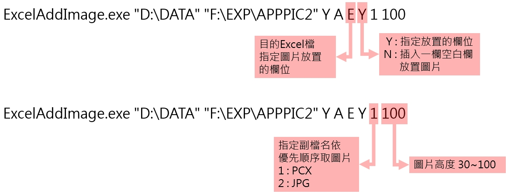

    

 2. 開啟COMMAND視窗執行

    ```shell
    D:\> ExcelAddImage.exe "D:\DATA" "F:\EXP\ADDPIC2" Y A E Y 1 100
    ```


3. 另存新檔

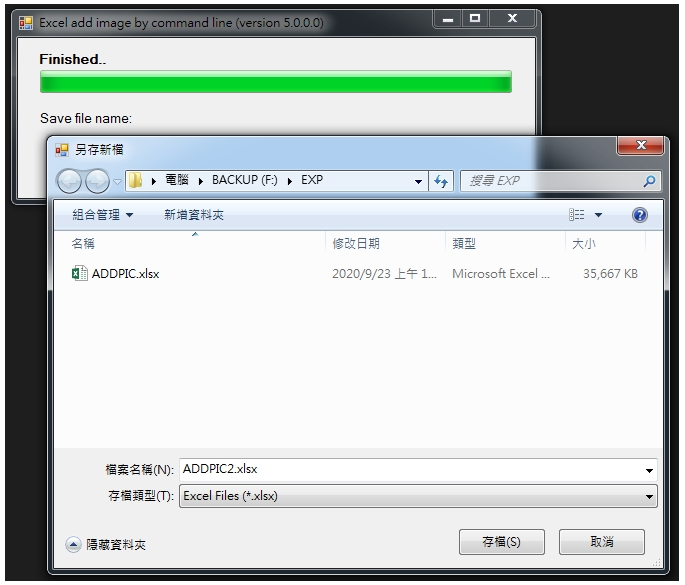


4. 開啟Excel

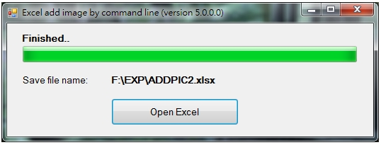


1. 產生結果

   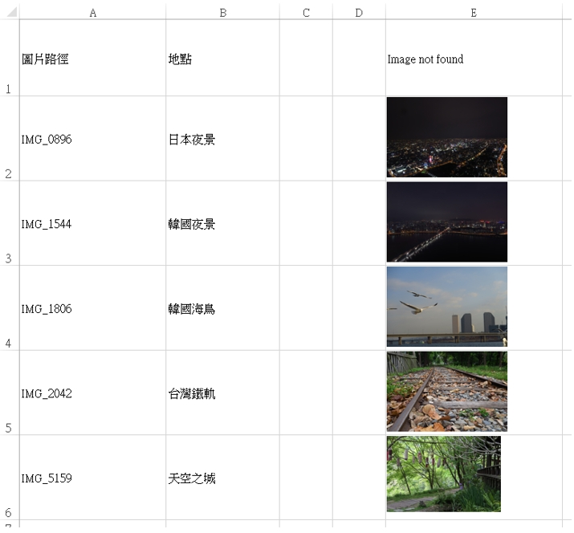

   

